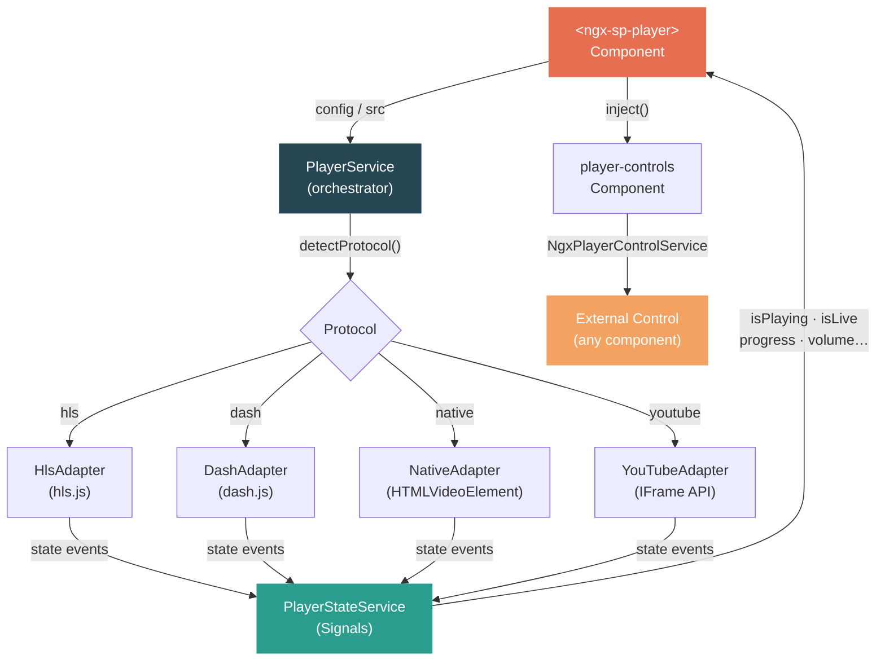
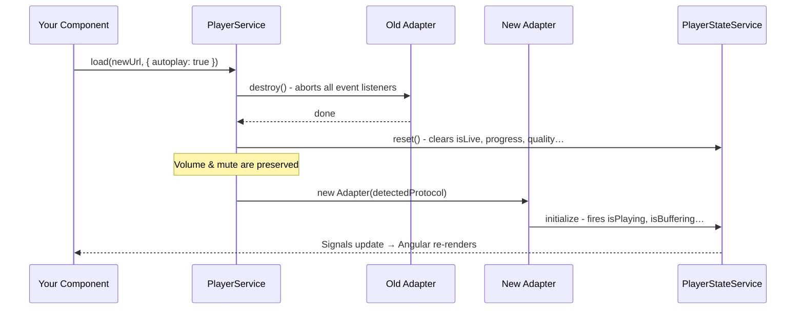
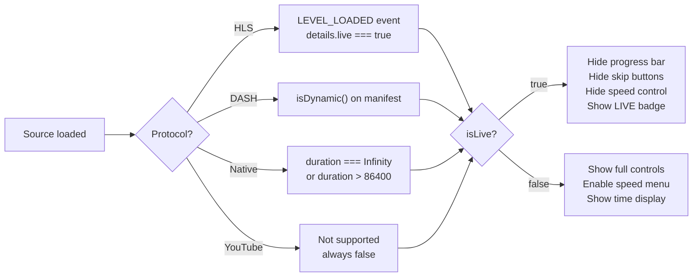
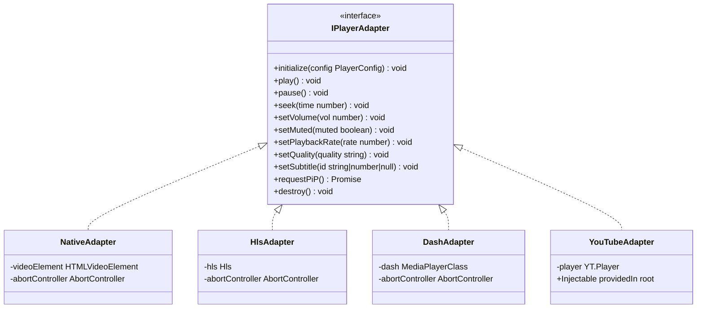

<div align="center">

# ngx-streaming-player

**Professional adaptive streaming player for Angular 17+**

[](https://angular.dev)
[](https://www.typescriptlang.org)
[](https://github.com/video-dev/hls.js)
[](https://github.com/Dash-IF/dash.js)
[](LICENSE)
[](https://www.npmjs.com/package/ngx-streaming-player)
[](https://angular.dev/guide/components/importing)
[](https://angular.dev/guide/signals)

A unified, **plug-and-play** video player component that handles **HLS**, **DASH**, **MP4**, and **YouTube** through a single API - with hot-swap source switching, live stream detection, multi-player support, PiP, subtitles, and full CSS theming.

[**Live Demo →**](https://jhonsferg.github.io/ngx-streaming-player)&nbsp;&nbsp;·&nbsp;&nbsp;[Report Bug](https://github.com/jhonsferg/ngx-streaming-player/issues)&nbsp;&nbsp;·&nbsp;&nbsp;[Request Feature](https://github.com/jhonsferg/ngx-streaming-player/issues)

</div>

---

## Table of Contents

- [Overview](#overview)
- [Architecture](#architecture)
- [Installation](#installation)
- [Quick Start](#quick-start)
- [Configuration](#configuration)
  - [providePlayer()](#provideplayer)
  - [Individual Inputs](#individual-inputs)
  - [Config Object](#config-object)
  - [Hot-swap Binding](#hot-swap-binding)
- [Protocol Support](#protocol-support)
  - [HLS Streaming](#hls-streaming)
  - [DASH Streaming](#dash-streaming)
  - [MP4 / Native](#mp4--native)
  - [YouTube](#youtube)
- [Live Streaming](#live-streaming)
- [Multi-player](#multi-player)
- [Programmatic Control](#programmatic-control)
- [Events & Reactive State](#events--reactive-state)
- [Theming](#theming)
- [Keyboard Shortcuts](#keyboard-shortcuts)
- [API Reference](#api-reference)
- [Comparison](#comparison)
- [Browser Support](#browser-support)
- [Project Structure](#project-structure)
- [Contributing](#contributing)
- [License](#license)

---

## Overview

`ngx-streaming-player` solves one specific problem: **you should not need a different component for every video protocol**. Whether the source is an HLS live stream, a DASH VOD file, a plain MP4, or a YouTube video, the template stays identical - only the URL changes.

```html
<!-- Same component, any protocol - auto-detected from the URL -->
<ngx-sp-player [src]="anyUrl"></ngx-sp-player>
```

| Source URL                          | Auto-detected protocol |
| ----------------------------------- | ---------------------- |
| `https://example.com/stream.m3u8`   | HLS via hls.js         |
| `https://example.com/manifest.mpd`  | DASH via dash.js       |
| `https://example.com/video.mp4`     | Native HTML5 video     |
| `https://www.youtube.com/watch?v=…` | YouTube IFrame API     |
| `https://youtu.be/…`                | YouTube IFrame API     |

---

## Architecture

The library uses an **Adapter Pattern** to isolate protocol-specific code from the component tree. `PlayerService` acts as the orchestrator - it selects the right adapter, initialises it, and exposes a unified reactive state via `PlayerStateService`.



### Hot-swap Flow



### Live Detection Flow



---

## Installation

```bash
npm install ngx-streaming-player hls.js dashjs
```

> **Peer dependencies** - `@angular/core ^21`, `@angular/common ^21`, `hls.js ^1`, `dashjs ^4`

---

## Quick Start

### 1. Configure the application (once)

Call `providePlayer()` in your `app.config.ts` to set global defaults, theme and translations. All feature functions are optional.

```typescript
// app.config.ts
import { ApplicationConfig } from '@angular/core';
import { providePlayer, withTheme, withDefaults, withTranslations } from 'ngx-streaming-player';

export const appConfig: ApplicationConfig = {
  providers: [
    providePlayer(
      // Global theme — applied as the lowest-priority layer for every player
      withTheme({ primaryColor: '#E76F51', borderRadius: '12px' }),

      // Global config defaults — overridden by any per-player [config] input
      withDefaults({ autoplay: false, enablePiP: true, enableKeyboard: true }),

      // UI string translations (any key you omit falls back to the English default)
      withTranslations({
        play: 'Reproducir (k)',
        pause: 'Pausar (k)',
        settings: 'Configuración',
        quality: 'Calidad',
        speed: 'Velocidad',
        captionsTracks: 'Subtítulos',
        auto: 'Automático',
        normalSpeed: 'Normal',
        subtitlesOff: 'Desactivado',
        live: 'EN VIVO',
      }),
    ),
  ],
};
```

### 2. Use the component

```typescript
// app.component.ts
import { Component } from '@angular/core';
import { StreamingPlayerComponent } from 'ngx-streaming-player';

@Component({
  standalone: true,
  imports: [StreamingPlayerComponent],
  template: `<ngx-sp-player [src]="streamUrl"></ngx-sp-player>`,
})
export class AppComponent {
  streamUrl = 'https://test-streams.mux.dev/x36xhzz/x36xhzz.m3u8';
}
```

The component auto-detects HLS, loads hls.js, and renders a fully featured player with controls, PiP, quality selector, settings menu, and keyboard shortcuts.

---

## Configuration

### Individual Inputs

The simplest API - pass only what you need:

```html
<ngx-sp-player
  src="https://example.com/stream.m3u8"
  [autoplay]="false"
  [muted]="false"
  [volume]="0.8"
  poster="https://example.com/thumbnail.jpg"
>
</ngx-sp-player>
```

### Config Object

For full control, use a `PlayerConfig` object:

```typescript
import { PlayerConfig } from 'ngx-streaming-player';

playerConfig: PlayerConfig = {
  src: 'https://example.com/stream.m3u8',

  // Playback
  autoplay: false,
  muted: false,
  volume: 1.0, // 0.0 – 1.0
  poster: 'https://example.com/thumb.jpg',
  playbackRates: [0.5, 0.75, 1, 1.25, 1.5, 2],

  // Protocol (optional - auto-detected from URL)
  protocol: 'hls', // 'hls' | 'dash' | 'native' | 'youtube'

  // Features
  enablePiP: true,
  enableKeyboard: true,

  // Controls behaviour
  controlsLayout: {
    autoHide: true,
    autoHideDelay: 3000, // ms
  },

  // Theming
  theme: {
    primaryColor: '#E76F51',
    secondaryColor: '#2A9D8F',
    accentColor: '#F4A261',
    backgroundColor: '#264653',
    textColor: '#F4F1DE',
    borderRadius: '10px',
    controlSize: '44px',
  },
};
```

```html
<ngx-sp-player
  [config]="playerConfig"
  playerId="main-player"
  (ready)="onReady()"
  (stateChange)="onState($event)"
  (playerError)="onError($event)"
  (played)="onPlay()"
  (paused)="onPause()"
  (videoEnded)="onEnded()"
  (timeUpdate)="onTime($event)"
  (qualityChange)="onQuality($event)"
>
</ngx-sp-player>
```

### Hot-swap Binding

Change `[src]` or call `NgxPlayerControlService.load()` at runtime - no component recreation:

```typescript
// Reactive binding - changing the signal triggers hot-swap automatically
currentSrc = signal('https://stream1.m3u8');

switchChannel(url: string): void {
  this.currentSrc.set(url);
}
```

```html
<ngx-sp-player [src]="currentSrc()" [config]="baseConfig"></ngx-sp-player>

<button (click)="switchChannel('https://stream2.mpd')">Switch to DASH</button>
<button (click)="switchChannel('https://cdn.example.com/video.mp4')">Switch to MP4</button>
```

> **Preserved on hot-swap:** volume level and mute state.
> **Resets on hot-swap:** playback position, buffered ranges, quality levels, live state, subtitle tracks.

---

## Protocol Support

### HLS Streaming

```typescript
hlsConfig: PlayerConfig = {
  src: 'https://test-streams.mux.dev/x36xhzz/x36xhzz.m3u8',
  // protocol auto-detected from .m3u8 extension
  autoplay: false,
  enablePiP: true,
};
```

**HLS-specific behaviour:**

- Uses `hls.js` with `lowLatencyMode: false` by default
- `lowLatencyMode` is **automatically enabled** once `LEVEL_LOADED` confirms a live stream (`details.live === true`)
- Quality levels populated from `MANIFEST_PARSED` event
- ABR enabled by default; override with `setQuality()`
- Event listeners cleaned up via `AbortController` on hot-swap

### DASH Streaming

```typescript
dashConfig: PlayerConfig = {
  src: 'https://dash.akamaized.net/akamai/bbb_30fps/bbb_30fps.mpd',
  // protocol auto-detected from .mpd extension
};
```

**DASH-specific behaviour:**

- Uses `dash.js` with ABR enabled
- Quality levels from `QUALITY_CHANGE_RENDERED` event
- Live detection via `isDynamic()` on the `MediaPlayer` instance
- Subtitle tracks from `getTracksFor('text')` after `STREAM_INITIALIZED`

### MP4 / Native

```typescript
mp4Config: PlayerConfig = {
  src: 'https://cdn.example.com/video.mp4',
  protocol: 'native', // or auto-detected for any non-HLS/DASH/YouTube URL
  poster: 'https://cdn.example.com/poster.jpg',
};
```

**Native-specific behaviour:**

- Uses the browser's native `HTMLVideoElement` directly - zero overhead
- Subtitle tracks auto-detected on `loadedmetadata` via `textTracks`
- Live detection via infinite duration fallback

### YouTube

```typescript
// All YouTube URL formats are auto-detected:
// https://www.youtube.com/watch?v=VIDEO_ID
// https://youtu.be/VIDEO_ID
// https://www.youtube.com/embed/VIDEO_ID

ytConfig: PlayerConfig = {
  src: 'https://www.youtube.com/watch?v=dQw4w9WgXcQ',
};

// Force YouTube with a bare video ID:
ytByIdConfig: PlayerConfig = {
  src: 'dQw4w9WgXcQ',
  protocol: 'youtube',
};
```

> **YouTube limitations**
> No Picture-in-Picture - IFrame API blocks the browser PiP API; the button is hidden automatically.
> Quality is suggested, not guaranteed - the IFrame API does not enforce quality levels.
> Autoplay requires `muted: true` in most browser contexts.

---

## Live Streaming

No configuration needed - live detection is fully automatic.

```typescript
liveConfig: PlayerConfig = {
  src: 'https://live-channel.m3u8',
  autoplay: true,
  muted: true, // required for browser autoplay policies
};
```

**When `isLive()` becomes `true`, the UI automatically adapts:**

| Control                      |    VOD    |   Live    |
| ---------------------------- | :-------: | :-------: |
| Progress bar (scrubber)      | ✅ Shown  | ❌ Hidden |
| Skip ±10 s buttons           | ✅ Shown  | ❌ Hidden |
| Time display `00:00 / 12:34` | ✅ Shown  | ❌ Hidden |
| Speed control in settings    | ✅ Shown  | ❌ Hidden |
| Animated LIVE badge          | ❌ Hidden | ✅ Shown  |

```typescript
// Read live state anywhere in your application
const state = this.playerControl.getState('live-player');

effect(() => {
  if (state?.isLive()) {
    console.log('Live stream detected');
    console.log('Duration:', state.duration()); // Infinity
  }
});
```

---

## Multi-player

Each `<ngx-sp-player>` with a unique `playerId` gets its own isolated `PlayerService` and `PlayerStateService` scope - instances do not share state:

```typescript
cameras = [
  { id: 'cam1', src: 'https://stream1.m3u8', label: 'Main Stage' },
  { id: 'cam2', src: 'https://stream2.m3u8', label: 'Side Stage' },
  { id: 'cam3', src: 'https://stream3.m3u8', label: 'Backstage' },
  { id: 'cam4', src: 'https://vod.example.com/replay.mpd', label: 'Replay' },
];
```

```html
<div class="camera-grid">
  @for (cam of cameras; track cam.id) {
  <ngx-sp-player [playerId]="cam.id" [src]="cam.src" [config]="{ autoplay: true, muted: true }">
  </ngx-sp-player>
  }
</div>
```

```typescript
// Control each player by its unique ID
muteAll(): void {
  this.cameras.forEach(c => this.ctrl.setMuted(true, c.id));
}

focusOn(id: string): void {
  this.cameras.forEach(c => {
    if (c.id !== id) this.ctrl.pause(c.id);
  });
  this.ctrl.play(id);
}

replaceStream(id: string, newUrl: string): void {
  this.ctrl.load(newUrl, { autoplay: true }, id);
}
```

> **Performance tip:** Use `IntersectionObserver` to lazily mount players only when they enter the viewport. Players outside the visible area don't consume CPU, memory, or network bandwidth.

---

## Programmatic Control

`NgxPlayerControlService` is injectable anywhere in your application tree:

```typescript
import { NgxPlayerControlService } from 'ngx-streaming-player';

@Component({ ... })
export class VideoController {
  private ctrl = inject(NgxPlayerControlService);

  // -- Playback ----------------------------------------------
  play()          { this.ctrl.play();              }
  pause()         { this.ctrl.pause();             }
  seek(s: number) { this.ctrl.seek(s);             }

  // -- Audio -------------------------------------------------
  mute()          { this.ctrl.setMuted(true);      }
  setVol(v)       { this.ctrl.setVolume(v);        } // 0.0 – 1.0

  // -- Quality & Speed ---------------------------------------
  hd()            { this.ctrl.setQuality('1080p'); }
  slow()          { this.ctrl.setPlaybackRate(0.5); }

  // -- Hot-swap ----------------------------------------------
  switchTo(url: string): void {
    this.ctrl.load(url, { autoplay: true }, 'my-player');
  }

  // -- Multi-player by ID ------------------------------------
  muteAll(ids: string[]): void {
    ids.forEach(id => this.ctrl.setMuted(true, id));
  }
}
```

### Reading Reactive State

All state is exposed as Angular Signals - no `subscribe()` or `async` pipes needed:

```typescript
@Component({
  template: `
    <p>{{ playing() ? 'Playing' : 'Paused' }}</p>
    <p>{{ timeDisplay() }}</p>
    <p>{{ state?.isLive() ? 'LIVE' : 'VOD' }}</p>
  `,
})
export class PlayerStatus {
  private ctrl = inject(NgxPlayerControlService);
  readonly state = this.ctrl.getState('my-player');

  readonly playing = computed(() => this.state?.isPlaying() ?? false);
  readonly timeDisplay = computed(() => {
    const t = this.state?.formattedCurrentTime() ?? '0:00';
    const d = this.state?.formattedDuration() ?? '0:00';
    return `${t} / ${d}`;
  });
}
```

---

## Events & Reactive State

### Component Outputs

```html
<ngx-sp-player
  [config]="playerConfig"
  playerId="main"
  (ready)="onReady()"
  (stateChange)="onState($event)"
  (playerError)="onError($event)"
  (played)="onPlay()"
  (paused)="onPause()"
  (videoEnded)="onEnded()"
  (timeUpdate)="onTime($event)"
  (durationChange)="onDuration($event)"
  (volumeChange)="onVolume($event)"
  (qualityChange)="onQuality($event)"
  (bufferingChange)="onBuffering($event)"
  (subtitleChange)="onSubtitle($event)"
  (fullscreenChange)="onFullscreen($event)"
  (pipChange)="onPiP($event)"
>
</ngx-sp-player>
```

```typescript
onReady(): void {
  // Player fully initialised — safe to issue commands
  this.ctrl.play('main');
}

onPlay(): void {
  analytics.track('play');
}

onPause(): void {
  analytics.track('pause');
}

onEnded(): void {
  this.showNextEpisode = true;
}

onTime(seconds: number): void {
  this.currentProgress = seconds;
}

onDuration(seconds: number): void {
  this.totalDuration = seconds;
}

onVolume(payload: { volume: number; muted: boolean }): void {
  this.userVolume = payload.volume;
}

onQuality(label: string): void {
  console.log('Quality changed to', label);
}

onBuffering(isBuffering: boolean): void {
  this.spinnerVisible = isBuffering;
}

onSubtitle(id: string | number | null): void {
  this.activeSubtitle = id;
}

onFullscreen(active: boolean): void {
  this.isFullscreen = active;
}

onPiP(active: boolean): void {
  this.isPiP = active;
}

onError(err: unknown): void {
  console.error('Playback error:', err);
}

onState(state: PlayerState): void {
  // Full state snapshot — useful for debugging or external state sync
  this.playerState = state;
}
```

### Available State Signals

| Signal                   | Type                   | Description                                     |
| ------------------------ | ---------------------- | ----------------------------------------------- |
| `isPlaying()`            | `boolean`              | Whether the player is currently playing         |
| `isBuffering()`          | `boolean`              | Whether the player is buffering                 |
| `isLive()`               | `boolean`              | Whether the current source is a live stream     |
| `isPiP()`                | `boolean`              | Whether Picture-in-Picture is active            |
| `isFullscreen()`         | `boolean`              | Whether fullscreen mode is active               |
| `currentTime()`          | `number`               | Current playback position in seconds            |
| `duration()`             | `number`               | Total duration in seconds (`Infinity` for live) |
| `progress()`             | `number`               | Playback progress as 0–100                      |
| `bufferedPercentage()`   | `number`               | Buffered amount as 0–100                        |
| `formattedCurrentTime()` | `string`               | Human-readable time e.g. `"1:23:45"`            |
| `formattedDuration()`    | `string`               | Human-readable duration                         |
| `volume()`               | `number`               | Current volume 0.0–1.0                          |
| `muted()`                | `boolean`              | Whether audio is muted                          |
| `playbackRate()`         | `number`               | Current playback speed multiplier               |
| `currentQuality()`       | `string`               | Active quality label e.g. `"1080p"` or `"auto"` |
| `availableQualities()`   | `QualityLevel[]`       | All quality levels from the manifest            |
| `supportsSubtitles()`    | `boolean`              | Whether subtitle tracks are available           |
| `availableSubtitles()`   | `SubtitleTrack[]`      | All detected subtitle tracks                    |
| `activeSubtitleId()`     | `string\|number\|null` | Active subtitle track ID, or `null`             |
| `supportsPiP()`          | `boolean`              | Whether PiP is available (false for YouTube)    |
| `isYouTube()`            | `boolean`              | Whether the active adapter is YouTube           |
| `isEnded()`              | `boolean`              | Whether the media has reached its natural end   |

---

## Theming

### Via the `theme` Input

```typescript
playerConfig: PlayerConfig = {
  src: '...',
  theme: {
    primaryColor: '#7C3AED', // Progress bar, seek thumb, active buttons
    secondaryColor: '#06B6D4', // Secondary accents
    accentColor: '#A78BFA', // Highlights, ripple effects, hover states
    backgroundColor: '#1e1b4b', // Player container background
    textColor: '#EDE9FE', // Text & icon colour
    borderRadius: '6px', // Container and control border radius
    controlSize: '40px', // Button hit-area size
  },
};
```

### Via CSS Custom Properties

```css
/* Scope to a specific player */
ngx-sp-player#my-player {
  --ngx-sp-primary: #7c3aed;
  --ngx-sp-secondary: #06b6d4;
  --ngx-sp-accent: #a78bfa;
  --ngx-sp-bg-dark: #1e1b4b;
  --ngx-sp-text-light: #ede9fe;
  --ngx-sp-radius: 6px;
  --ngx-sp-control-size: 40px;
}

/* Override globally */
:root {
  --ngx-sp-primary: #7c3aed;
}
```

### CSS Variable Reference

| Variable                  | Default                     | Maps to `PlayerTheme` |
| ------------------------- | --------------------------- | --------------------- |
| `--ngx-sp-primary`        | `#E76F51`                   | `primaryColor`        |
| `--ngx-sp-secondary`      | `#2A9D8F`                   | `secondaryColor`      |
| `--ngx-sp-accent`         | `#F4A261`                   | `accentColor`         |
| `--ngx-sp-bg-dark`        | `#1a1a2e`                   | `backgroundColor`     |
| `--ngx-sp-text-light`     | `#F4F1DE`                   | `textColor`           |
| `--ngx-sp-text-dark`      | `#1a1a2e`                   | -                     |
| `--ngx-sp-overlay-bg`     | `rgba(0,0,0,0.6)`           | -                     |
| `--ngx-sp-control-size`   | `44px`                      | `controlSize`         |
| `--ngx-sp-radius`         | `8px`                       | `borderRadius`        |
| `--ngx-sp-ease`           | `cubic-bezier(0.4,0,0.2,1)` | -                     |
| `--ngx-sp-font-display`   | system-ui                   | -                     |
| `--ngx-sp-font-body`      | system-ui                   | -                     |
| `--ngx-sp-font-mono`      | monospace                   | -                     |
| `--ngx-sp-primary-shadow` | auto                        | -                     |
| `--ngx-sp-primary-glow`   | auto                        | -                     |

---

## Keyboard Shortcuts

Enabled by default (`enableKeyboard: true`). Active when the player container is focused.

| Key           | Action                                     |
| ------------- | ------------------------------------------ |
| `Space` / `K` | Toggle play / pause                        |
| `←`           | Seek backward 5 s                          |
| `→`           | Seek forward 5 s                           |
| `J`           | Seek backward 10 s                         |
| `L`           | Seek forward 10 s                          |
| `↑`           | Volume up 10%                              |
| `↓`           | Volume down 10%                            |
| `M`           | Toggle mute                                |
| `F`           | Toggle fullscreen                          |
| `I`           | Toggle Picture-in-Picture                  |
| `C`           | Toggle subtitles (cycles available tracks) |

---

## API Reference

### `providePlayer()`

Configure the library globally in `ApplicationConfig.providers` (standalone) or `NgModule.providers`:

```typescript
import { providePlayer, withTheme, withDefaults, withTranslations } from 'ngx-streaming-player';

providePlayer(
  withTheme(theme),        // Partial<PlayerTheme>  — global baseline theme
  withDefaults(config),    // Partial<PlayerConfig> — global config defaults
  withTranslations(map),   // Partial<PlayerTranslations> — UI string overrides
)
```

**Priority rules:**

| Layer | Wins over |
|---|---|
| Per-player `[theme]` / `[config]` input | `withTheme()` / `withDefaults()` |
| `config.theme` object | `withTheme()` |
| `withTheme()` | Component stylesheet defaults |

---

### `PlayerTranslations`

All keys are optional in `withTranslations()`. Missing keys fall back to English defaults.

| Key | Default | Description |
|---|---|---|
| `play` | `'Play (k)'` | Play button tooltip |
| `pause` | `'Pause (k)'` | Pause button tooltip |
| `subtitles` | `'Subtitles (c)'` | Subtitles toggle tooltip |
| `pip` | `'Picture in picture (i)'` | PiP button tooltip |
| `fullscreen` | `'Fullscreen (f)'` | Enter-fullscreen tooltip |
| `exitFullscreen` | `'Exit fullscreen (f)'` | Exit-fullscreen tooltip |
| `watchOnYouTube` | `'Watch on YouTube'` | YouTube link title |
| `live` | `'LIVE'` | Live-stream badge text |
| `settings` | `'Settings'` | Settings panel header |
| `quality` | `'Quality'` | Quality row / sub-panel heading |
| `speed` | `'Speed'` | Speed row / sub-panel heading |
| `captionsTracks` | `'Subtitles'` | Captions row / sub-panel heading |
| `auto` | `'Auto'` | ABR quality option label |
| `normalSpeed` | `'Normal'` | 1× speed option label |
| `subtitlesOff` | `'Off'` | Subtitles disabled option |
| `subtitlesEnabled` | `'On'` | Fallback when track has no label |

---

### `<ngx-sp-player>` Inputs

| Input      | Type           | Default     | Description                                                  |
| ---------- | -------------- | ----------- | ------------------------------------------------------------ |
| `config`   | `PlayerConfig` | -           | Full configuration object                                    |
| `src`      | `string`       | -           | Media URL - overrides `config.src`. Changes trigger hot-swap |
| `autoplay` | `boolean`      | `false`     | Start playback on load                                       |
| `muted`    | `boolean`      | `false`     | Start with audio muted                                       |
| `volume`   | `number`       | `1.0`       | Initial volume (0.0–1.0)                                     |
| `poster`   | `string`       | -           | Poster image URL shown before playback                       |
| `theme`    | `PlayerTheme`  | -           | Theme overrides - merged with `config.theme`                 |
| `playerId` | `string`       | `'default'` | Unique ID - required for multi-player setups                 |

### `<ngx-sp-player>` Outputs

| Output             | Payload                              | When                                                          |
| ------------------ | ------------------------------------ | ------------------------------------------------------------- |
| `ready`            | `void`                               | Player finished initialising and is ready to play             |
| `stateChange`      | `PlayerState`                        | Any state change — full snapshot on every mutation            |
| `playerError`      | `unknown`                            | Fatal or recoverable adapter error                            |
| `played`           | `void`                               | Playback starts or resumes                                    |
| `paused`           | `void`                               | Playback pauses                                               |
| `videoEnded`       | `void`                               | Media reaches its natural end                                 |
| `timeUpdate`       | `number`                             | Current position in seconds (≈ every 250 ms while playing)    |
| `durationChange`   | `number`                             | Total duration detected or changed (seconds)                  |
| `volumeChange`     | `{ volume: number; muted: boolean }` | Volume level or mute state changed                            |
| `qualityChange`    | `string`                             | Active quality label changed (e.g. `'1080p'`, `'auto'`)       |
| `bufferingChange`  | `boolean`                            | `true` when buffering starts, `false` when it ends            |
| `subtitleChange`   | `string \| number \| null`           | Active subtitle track changed (`null` = disabled)             |
| `fullscreenChange` | `boolean`                            | Player enters (`true`) or exits (`false`) fullscreen          |
| `pipChange`        | `boolean`                            | Player enters (`true`) or exits (`false`) Picture-in-Picture  |

### `PlayerEvents` Callback API

As an alternative to Angular output bindings, pass a plain object via `[events]`:

```typescript
import { PlayerEvents } from 'ngx-streaming-player';

readonly playerEvents: PlayerEvents = {
  onPlay:            () => analytics.track('play'),
  onPause:           () => analytics.track('pause'),
  onEnded:           () => (this.showNextEpisode = true),
  onTimeUpdate:      (t) => (this.progress = t),
  onDurationChange:  (d) => (this.duration = d),
  onVolumeChange:    (v) => (this.volume = v),
  onQualityChange:   (q) => console.log('quality →', q),
  onBufferingChange: (b) => (this.spinner = b),
  onSubtitleChange:  (id) => (this.subtitle = id),
  onFullscreenChange:(fs) => (this.fullscreen = fs),
  onPiPChange:       (pip) => (this.pip = pip),
  onError:           (err) => console.error(err),
};
```

```html
<ngx-sp-player [config]="config" [events]="playerEvents" />
```

### `PlayerConfig` Interface

```typescript
interface PlayerConfig {
  src: string;
  protocol?: 'hls' | 'dash' | 'native' | 'youtube';
  autoplay?: boolean; // default: false
  muted?: boolean; // default: false
  volume?: number; // default: 1.0
  poster?: string;
  playbackRates?: number[]; // default: [0.25, 0.5, 0.75, 1, 1.25, 1.5, 1.75, 2]
  enablePiP?: boolean; // default: true
  enableKeyboard?: boolean; // default: true
  controlsLayout?: {
    autoHide?: boolean; // default: true
    autoHideDelay?: number; // default: 3000 (ms)
  };
  theme?: PlayerTheme;
}
```

### `PlayerTheme` Interface

```typescript
interface PlayerTheme {
  primaryColor?: string; // --ngx-sp-primary
  secondaryColor?: string; // --ngx-sp-secondary
  accentColor?: string; // --ngx-sp-accent
  backgroundColor?: string; // --ngx-sp-bg-dark
  textColor?: string; // --ngx-sp-text-light
  borderRadius?: string; // --ngx-sp-radius
  controlSize?: string; // --ngx-sp-control-size
}
```

### `NgxPlayerControlService` Methods

| Method              | Signature                                      | Description                                                                     |
| ------------------- | ---------------------------------------------- | ------------------------------------------------------------------------------- |
| `load()`            | `(src, overrides?, playerId?) => void`         | Hot-swap source - destroys current adapter, resets state, preserves volume/mute |
| `play()`            | `(playerId?) => void`                          | Start playback                                                                  |
| `pause()`           | `(playerId?) => void`                          | Pause playback                                                                  |
| `seek()`            | `(time, playerId?) => void`                    | Jump to time in seconds                                                         |
| `setVolume()`       | `(vol, playerId?) => void`                     | Set volume 0.0–1.0                                                              |
| `setMuted()`        | `(muted, playerId?) => void`                   | Mute or unmute                                                                  |
| `setPlaybackRate()` | `(rate, playerId?) => void`                    | Change speed (ignored on live streams)                                          |
| `setQuality()`      | `(quality, playerId?) => void`                 | Force quality level or `'auto'`                                                 |
| `setSubtitle()`     | `(id\|null, playerId?) => void`                | Activate a subtitle track, or `null` to disable                                 |
| `getState()`        | `(playerId?) => PlayerStateService\|undefined` | Returns the full reactive state service                                         |
| `isRegistered()`    | `(playerId?) => boolean`                       | Check if a player with this ID is active                                        |

### `SubtitleTrack` Interface

```typescript
interface SubtitleTrack {
  id: string | number;
  label: string;
  language: string;
}
```

---

## Comparison

| Feature               | **ngx-streaming-player** | VG Player | Video.js Angular | Plain `<video>` |
| --------------------- | :----------------------: | :-------: | :--------------: | :-------------: |
| Angular Signals API   |            ✅            |    ❌     |        ❌        |       ❌        |
| Standalone component  |            ✅            |    ⚠️     |        ⚠️        |       ✅        |
| HLS (hls.js)          |            ✅            |    ✅     |        ✅        |       ❌        |
| DASH (dash.js)        |            ✅            |    ⚠️     |        ⚠️        |       ❌        |
| YouTube IFrame        |            ✅            |    ❌     |        ⚠️        |       ❌        |
| Hot-swap protocol     |            ✅            |    ❌     |        ❌        |       ❌        |
| Auto live detection   |            ✅            |    ⚠️     |        ⚠️        |       ❌        |
| Speed hidden on live  |            ✅            |    ❌     |        ❌        |       ❌        |
| Multi-player isolated |            ✅            |    ⚠️     |        ⚠️        |       ✅        |
| Picture-in-Picture    |            ✅            |    ❌     |        ⚠️        |       ✅        |
| Subtitle tracks       |            ✅            |    ⚠️     |        ✅        |       ✅        |
| CSS variable theming  |            ✅            |    ⚠️     |        ⚠️        |       ❌        |
| OnPush compatible     |            ✅            |    ❌     |        ❌        |       ✅        |
| TypeScript-first      |            ✅            |    ✅     |        ⚠️        |       ✅        |
| Angular 17+ support   |            ✅            |    ⚠️     |        ⚠️        |       ✅        |
| Programmatic service  |            ✅            |    ⚠️     |        ⚠️        |       ❌        |

> ✅ Full support &nbsp;·&nbsp; ⚠️ Partial or requires extra configuration &nbsp;·&nbsp; ❌ Not supported

---

## Browser Support

| Browser        | HLS | DASH | Native MP4 | YouTube | PiP |
| -------------- | :-: | :--: | :--------: | :-----: | :-: |
| Chrome 90+     | ✅  |  ✅  |     ✅     |   ✅    | ✅  |
| Firefox 88+    | ✅  |  ✅  |     ✅     |   ✅    | ✅  |
| Safari 14+     | ✅  |  ✅  |     ✅     |   ✅    | ✅  |
| Edge 90+       | ✅  |  ✅  |     ✅     |   ✅    | ✅  |
| iOS Safari 14+ | ✅  |  ⚠️  |     ✅     |   ✅    | ⚠️  |
| Android Chrome | ✅  |  ✅  |     ✅     |   ✅    | ✅  |

> Safari natively supports HLS - hls.js detects `Hls.isSupported()` and falls back to native playback automatically.

---

## Project Structure

```
ngx-streaming-player/
├-- projects/
│   ├-- ngx-streaming-player/        ← Library source
│   │   └-- src/lib/
│   │       ├-- adapters/
│   │       │   ├-- native/          ← HTMLVideoElement adapter
│   │       │   ├-- hls/             ← hls.js adapter
│   │       │   ├-- dash/            ← dash.js adapter
│   │       │   └-- youtube/         ← YouTube IFrame API adapter
│   │       ├-- components/
│   │       │   ├-- streaming-player/   ← Main public component
│   │       │   └-- player-controls/    ← Controls bar + sub-components
│   │       │       ├-- ngx-sp-button/
│   │       │       ├-- ngx-sp-progress-bar/
│   │       │       ├-- ngx-sp-volume-control/
│   │       │       ├-- ngx-sp-settings-menu/
│   │       │       └-- ngx-sp-time-display/
│   │       ├-- services/
│   │       │   ├-- player.service.ts         ← Orchestrator + adapter factory
│   │       │   └-- player-state.service.ts   ← Reactive state (Signals)
│   │       └-- models/
│   │           └-- player.models.ts          ← Interfaces & types
│   └-- demo/                        ← Demo app (GitHub Pages)
├-- dist/                            ← Built library output
└-- README.md
```

### Adapter Class Diagram



---

## Contributing

Contributions are welcome. Please follow these steps:

1. **Fork** the repository and create a feature branch: `git checkout -b feat/my-feature`
2. **Install** dependencies: `npm install`
3. **Start** the dev server: `npm start`
4. **Build** the library: `npm run build:lib`
5. **Commit** using [Conventional Commits](https://www.conventionalcommits.org/): `feat: …`, `fix: …`, `docs: …`
6. Open a **Pull Request** with a clear description

### Development Commands

```bash
npm start             # Start showcase app with library source in watch mode
npm run build:lib     # Build library → dist/ngx-streaming-player
npm run build:showcase # Build showcase app for production
npm run lint          # Run ESLint across the workspace
npm run type-check    # TypeScript type-check without emitting
```

### Build Budgets

The showcase app (`projects/app`) enforces Angular build budgets to catch bundle bloat early:

| Budget type         | Warning threshold | Error threshold |
|---------------------|:-----------------:|:---------------:|
| `initial` (total JS+CSS) | 3 MB         | 5 MB            |
| `anyComponentStyle` | 40 kB             | 80 kB           |

Current production output (approximate):

| Chunk        | Raw size | Transferred (gzip) |
|--------------|:--------:|:------------------:|
| `main.js`    | ~2.06 MB | ~506 kB            |
| `styles.css` | ~16 kB   | ~1.2 kB            |

Budgets are configured in `angular.json` under `projects › showcase › architect › build › configurations › production › budgets`.

### CI / CD Pipeline

Every push to `main` runs the **CI / Deploy** workflow (`.github/workflows/ci.yml`):

```
push to main
  └─ ci job
       ├─ npm ci
       ├─ npm run lint
       ├─ npm run type-check
       ├─ npm run build:lib          → dist/ngx-streaming-player/
       ├─ npm run build:showcase     → dist/showcase/browser/
       ├─ touch .nojekyll            (prevent Jekyll processing)
       └─ cp index.html 404.html     (SPA fallback for deep links)
  └─ deploy job (main push only)
       └─ actions/deploy-pages@v4   → GitHub Pages
```

- Pull requests run only the `ci` job (build + lint + type-check) — no deployment.
- The `concurrency` group cancels any in-progress run for the same ref, so rapid pushes never queue duplicate deployments.

### Adding a New Adapter

1. Create `projects/ngx-streaming-player/src/lib/adapters/myprotocol/myprotocol.adapter.ts`
2. Implement `IPlayerAdapter`
3. Add detection logic in `player.service.ts` → `detectProtocol()` and `createAdapter()`
4. Export from `src/public-api.ts` if it needs to be injectable externally

---

## License

MIT © [jhonsferg](https://github.com/jhonsferg)

---

<div align="center">

Built with [Angular](https://angular.dev) &nbsp;·&nbsp; [hls.js](https://github.com/video-dev/hls.js) &nbsp;·&nbsp; [dash.js](https://github.com/Dash-IF/dash.js)

</div>
